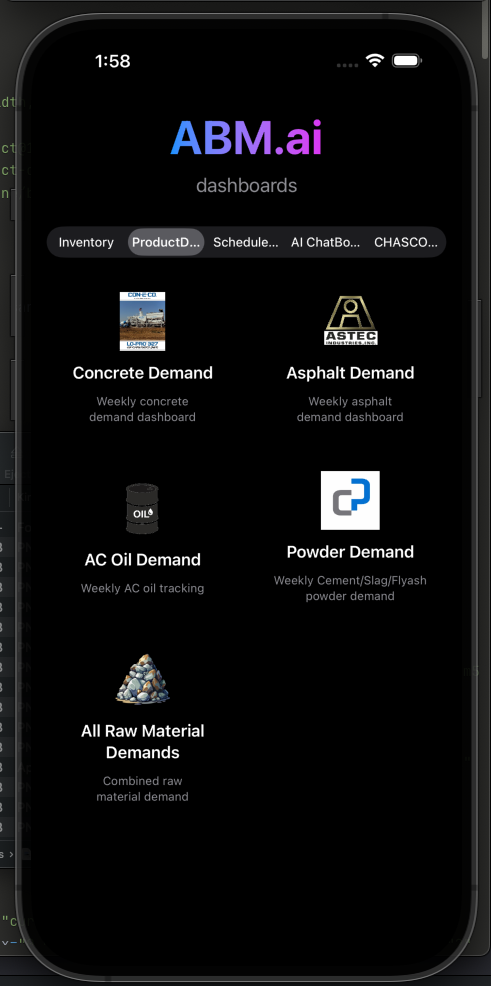
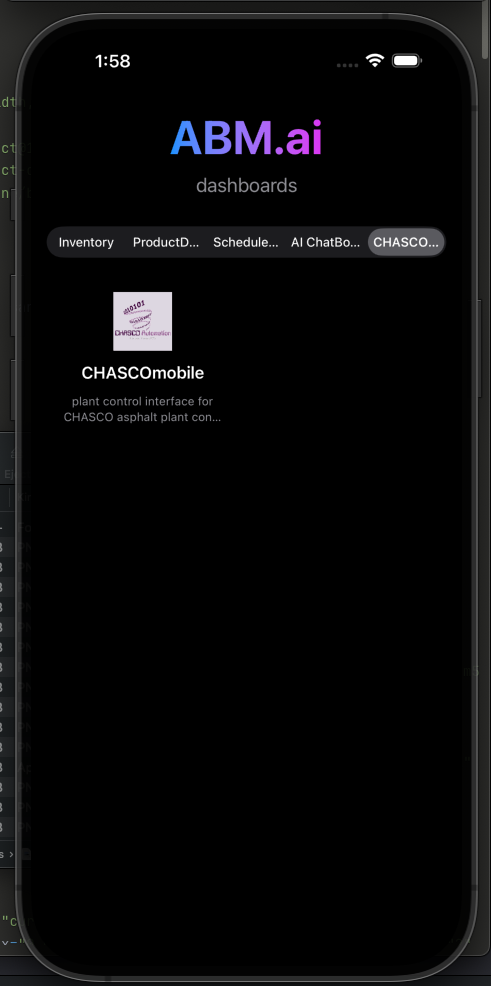

# ABM.ai - Operational Dashboards

> Real-time operational intelligence for asphalt, concrete, and materials management

**ABM.ai** is a native iOS application that brings your entire operations ecosystem to your mobile device. Access live inventory levels, demand forecasts, driver schedules, AI-powered tools, and plant control systems—all from one beautifully designed interface.



---

## Main Features

### 📊 Real-Time Dashboards

Access 10 live operational dashboards and 3 WIP dashboards organized by category:

#### **Inventory Management**
- **Chameleon Inventory** - Real-time pigment tracking for Pittsburg & Brentwood plants
  - Monitor A1010, A1070, A550, A875, A8090 levels
  - Track incoming orders and delivery schedules
  - EOD rinse status tracking
- **Admix Inventory** - Admixture and dry additives monitoring
  - DV1000, RECOVER, ISOFLEX series, ECLIPSE, ISOXEL, VMAR3
  - Dry goods tracking (fiber, XYPEX, expansion joints)
  - Multi-plant visibility
- **Inventory Submission** - Update inventory levels from anywhere

#### 📈 **Weekly Demand Analytics**
- **Concrete Demand** - Weekly concrete production forecasts
- **Asphalt Demand** - Asphalt production planning
- **AC Oil Demand** - Asphalt cement oil tracking
- **Powder Demand** - Cement, slag, and flyash monitoring
- **Raw Materials** - Combined material demand overview

####**Operations & Scheduling**
- **Driver Schedule** - Real-time driver scheduling dashboard
  - Organized by work point
  - Truck assignments
  - Start times and notes

#### 🤖 **AI-Powered Tools**
- **Concrete Quote AI** - Instant AI-generated concrete quotes
- **Mix Design Assist** - AI-powered mix design recommendations

#### ⚙️ **Plant Control**
- **CHASCOmobile** - SCADA plant control interface *(Preview)*



> **Coming Soon:** CHASCOmobile can provide full control and monitoring of the CHASCO asphalt plant directly from your iOS device. Real-time temperature monitoring, batch controls, and production metrics.

---

##  Technical Stack

### Frontend
- **SwiftUI** - Modern iOS native interface
- **WKWebView** - Hybrid web content rendering
- **UIKit** - iOS framework integration

### Backend & Data
- **Supabase** - PostgreSQL database with real-time subscriptions
- **REST API** - Direct database queries
- **Auto-refresh** - 30-90 second polling intervals

### Dashboard Technologies
- **React** - Interactive dashboard components
- **Tailwind CSS** - Responsive styling
- **HTML5/JavaScript** - Web-based visualizations

---

## 📱 Platform Support

- **iOS 17.0+** - iPhone & iPad
- **macOS 14.0+** (coming soon)
- Android Support (coming soon)
- Native Web App (Coming Soon)

---

## 🎯 Current Status

**Version:** 1.0 Beta
**Release Target:** TestFlight edition (iOS & macOS)

---

## 🔮 Roadmap

### Phase 1 (Current - Prototype) ✅
- [x] Dashboard selector interface
- [x] WKWebView integration for all dashboards
- [x] Category-based navigation
- [x] Supabase connectivity for rapid data availability from selected data sources.

### Phase 2 (Native Migration)
- [ ] Migrate high-priority dashboards to native SwiftUI for a cleaner look
- [ ] Integrate Supabase Swift SDK for direct database access when running app.
- [ ] Real-time subscriptions to data should it change while viewing.
- [ ] Offline capability with local caching so the captured dashboard stays with out
- [ ] Native authentication to data services
- [ ] iPad Support

### Phase 3 (CHASCOmobile Integration)
- [ ] Live SCADA data integration
- [ ] Plant control commands customized as needed
- [ ] Real-time alerts and monitoring
- [ ] Ability to make changes from anywhere
- [ ] Secure native VPN access to CHASCO through the app

### Phase 4 (Advanced Features)
- [ ] Push notifications for inventory alerts and delivery updates
- [ ] Multi-user collaboration allowing updating certain data points in app
- [ ] Export reports (PDF/Excel)
- [ ] Email dashboard PDFs through email to share
- [ ] Manager level authentication for Financial Insight Dashboards

---

## 📦 Project Navigation Structure

```
Dane/
├── Dashboard.swift           # Dashboard models and data
├── DashboardWebView.swift    # WKWebView wrapper
├── ContentView.swift         # Main UI
├── DaneApp.swift            # App entry point
├── DashboardAssets/         # HTML dashboards
│   ├── ChameleonInventory/
│   ├── AdmixInventory/
│   ├── ConcreteDemandWeekly/
│   ├── AsphaltDemandWeekly/
│   ├── ACoilWeekly/
│   ├── PowderWeekly/
│   ├── RawMaterialDemandCombWeekly/
│   ├── ScheduleDashboard/
│   ├── InventorySubmission/
│   ├── ConcreteQuoteAI/
│   ├── MixDesignAssistAI/
│   └── CHASCOmobile/
└── DashboardAssets/Dashboardlogos/  # Brand logos
```

---

## 🔐 Database Configuration

The app connects to a Supabase PostgreSQL database:
- **Authentication:** Anonymous key (public read access)

> **Security Note:** Production builds will implement Row Level Security (RLS) and proper authentication.

---

This is a private enterprise application. Intended for onsite access by ABM employees

## 📞 Support

For issues or questions:
- Internal: dane@antiochbuilding.com
- GitHub: https://github.com/davisdane2/ABMai/issues

---

Dashboard logos and icons are proprietary to:
- CEMEX LLC
- Deister Machine Co.
- ASTEC (American Standard Testing & Engineering)
- CHASCO Automation

---

Built with:
- **SwiftUI** by Apple
- **Supabase** for backend infrastructure
- **Claude Code** for AI-assisted development
- **React** & **Tailwind CSS** for dashboard UIs

---
